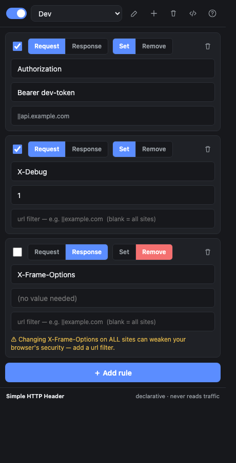
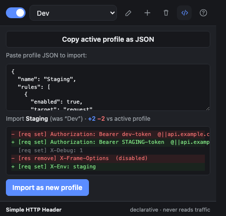

# Simple HTTP Header

A tiny, open-source Chrome extension to modify HTTP request & response headers.
Think ModHeader, but **small, auditable, and privacy-first**.

<p align="center">
  
  &nbsp;&nbsp;
  
</p>
<p align="center"><sub>Rule list · Import/export with live diff</sub></p>

- **Fast** — rules run in Chrome's native network stack via
  [`declarativeNetRequest`](https://developer.chrome.com/docs/extensions/reference/api/declarativeNetRequest).
  Zero JavaScript executes per request.
- **Secure** — the extension is *declarative*: it tells Chrome what to do and
  **never reads, streams, or has access to your traffic**. No `webRequest`, no
  remote code, no external network calls, no analytics.
- **Simple** — vanilla JS, **no build step**, no dependencies. ~5 small files
  you can read in one sitting.

## Features

- Set / modify request headers
- Remove request headers
- Set / remove response headers
- Optional per-rule URL filter (e.g. `||example.com`, `/api/`)
- Named **profiles** (dev / staging / …) with a one-click active switch
- **Master on/off** toggle
- Light & dark mode

## Install (unpacked)

1. `git clone` this repo.
2. Open `chrome://extensions`.
3. Enable **Developer mode** (top-right).
4. **Load unpacked** → select the `simple-http-header/` folder.
5. Pin the icon, open the popup, add rules.

Works in any Chromium browser (Chrome, Edge, Brave, Arc).

## Usage

- **Master switch** (top-left) turns every rule on/off at once.
- **＋ Add rule** appends a rule. Each rule row has: an enable checkbox, a
  **Request / Response** toggle, a **Set / Remove** toggle, and header
  name / value / url-filter inputs. A bad rule shows a red reason; a response
  rule with no filter shows an amber "applies to every site" warning.
- **Profiles** — the dropdown switches the active profile; the ✎ / ＋ / 🗑 icons
  rename, create, and delete profiles. Deletes show a 6-second **Undo** toast.
- The toolbar **badge** shows the active rule count, or `off`.

Verify quickly: add a `set` request header `X-Debug: 1`, then visit
<https://httpbin.org/headers> — the echoed JSON should include your header.

### Import / export profiles

The **⇄** button opens the import/export panel:

- **Copy active profile as JSON** puts the current profile on your clipboard.
- Paste a profile JSON into the box and **Import as new profile** to add it.

Share a set of headers by copying the JSON and sending it to a teammate. Imported
JSON is fully sanitized — unknown fields are dropped and every value is coerced to
a safe default, so a malformed paste can never create an unsafe rule. Shape:

```json
{
  "name": "Dev",
  "rules": [
    { "enabled": true, "target": "request", "operation": "set",
      "name": "X-Debug", "value": "1", "urlFilter": "||example.com" }
  ]
}
```

### URL filters

Each rule has an optional **url filter** that scopes it to matching URLs — leave
it blank to apply everywhere. Click the **?** in the popup for the same cheatsheet.

| Filter | Matches |
| --- | --- |
| *(blank)* | all sites |
| `\|\|example.com` | `example.com` and all subdomains, any path |
| `\|https://` | only HTTPS requests |
| `/api/` | any URL containing `/api/` |
| `example.com` | any URL containing that text |
| `.json\|` | URLs ending in `.json` |
| `*/graphql` | `*` wildcard; path ending in `/graphql` |

Matching is case-insensitive. `|` anchors the start/end of the URL, `||` anchors
a domain, `*` is a wildcard, `^` matches a separator. This is Chrome's native
[`urlFilter` syntax](https://developer.chrome.com/docs/extensions/reference/api/declarativeNetRequest#property-RuleCondition-urlFilter).

## Security model & the `<all_urls>` permission

To edit headers on any site, `declarativeNetRequest`'s `modifyHeaders` action
requires host permissions, so the manifest requests `host_permissions:
["<all_urls>"]`. This looks broad, but with DNR it is the *safe* shape:

- The extension **cannot read** request/response contents, cookies, or bodies.
  It only registers declarative rules that the browser applies itself.
- Contrast with `webRequest`-based tools, which stream every request through
  extension JavaScript.

Header values are stored in **`chrome.storage.local`, never `storage.sync`** —
so auth tokens or secrets you put in a header stay on this machine and are never
replicated to your Google account.

Header names are validated against the RFC 7230 token charset and values are
rejected if they contain CR/LF, preventing header-injection.

## Development

```bash
npm test        # runs the pure rule-logic tests (node --test, no deps)
```

No bundler. Edit files under `src/`, then hit the reload icon on the extension
card in `chrome://extensions`.

| File | Role |
| --- | --- |
| `manifest.json` | MV3 manifest, permissions |
| `src/background.js` | service worker: syncs state → DNR dynamic rules, badge |
| `src/storage.js` | state read/write (`chrome.storage.local`) |
| `src/rules.js` | validation + Rule → DNR conversion (pure, tested) |
| `src/popup.*` | the single-view UI |

## License

MIT — see [LICENSE](LICENSE).
